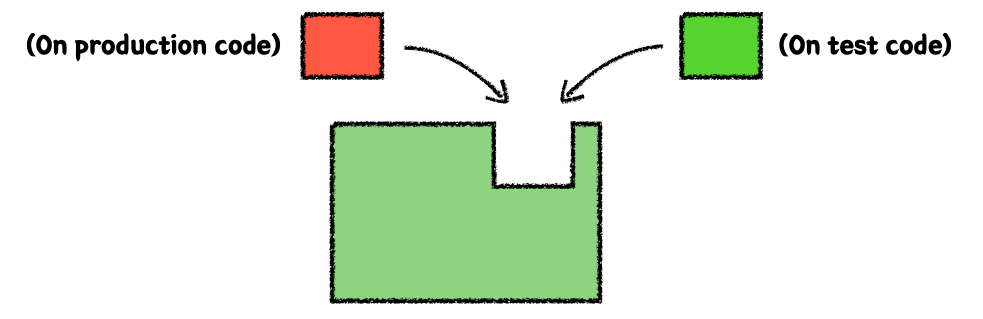
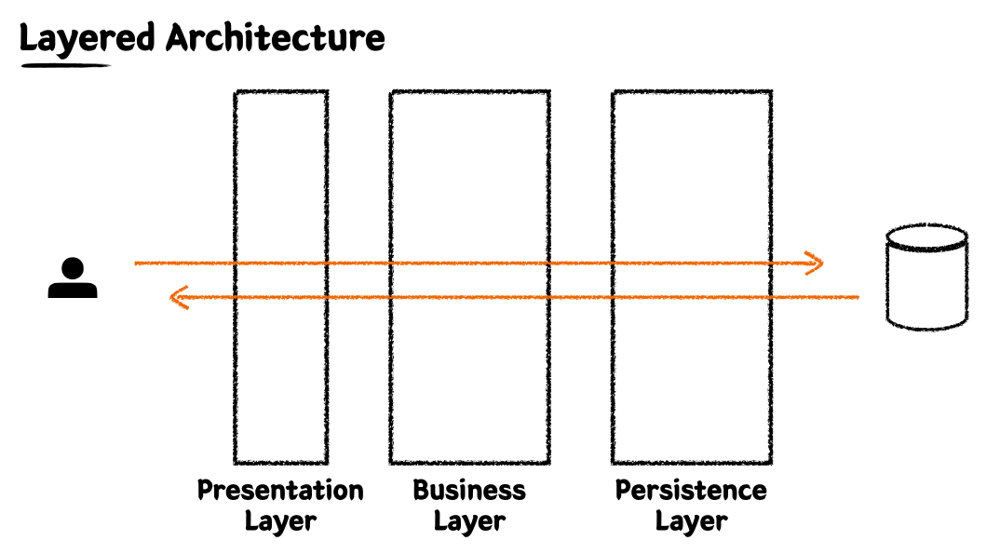
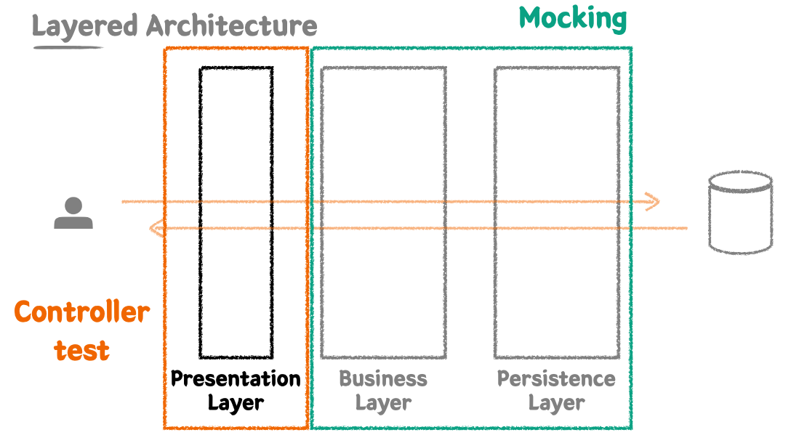

# 実用的なテストの書き方（Practical Test）

- 簡単なカフェキオスクアプリケーションを作りながら学

## 単体テスト（Unit Test）

- 小さいコード単体を独立的に検証するテスト
    - クラス又はメソッド
    - 外部に依存しない一番小さいテストの単位
- 検証速度が早く、安定的
- Java では JUint5 を使う
    - 単体テストの為のテストフレームワーク
    - XUnit - Kent Beck
        - https://junit.org/junit5/
- AssertJ
    - テストコード作成を円滑に助けてくれるライブラリ
    - 豊富なAPI、メソッドチェーン（Chaining）をサポートする
    - https://joel-costigliola.github.io/assertj/

## テストケースの細分化

- ハッピーケース
- 例外ケース
- どちらも境界(範囲、区間、日付等々)テストが重要
    - ex) 3以上の定数が条件の場合境界テストは`3`(ハッピーケース)と`2`(例外ケース)をやる

## テストし辛い領域を分離する

```java
// テストしづらいコード
public Order createOrder() {
  var currentDateTime = LocalDateTime.now();
  var currentTime = currentDateTime.toLocalTime();
}

// テストし辛い領域を分離する。
public Order createOrder(LocalDateTime currentDateTime) {
  var currentTime = currentDateTime.toLocalTime();
}
```



- 外部に分離することでテスト可能なコードが多くなる。
- テストをしようとする領域とテストがし辛い領域を区分することが大事だ。

### テストがしづらい領域の例

- 観測（観察、照会）する度に他の値に依存するコード
    - 日付、時間、ランダム数、グローバル変数、クライアントのインプット値等々
- 外部領域に影響を与えるコード
    - std.out, メッセージ発送、データベースに記録等々

### テストし優しい例

- 同じ入力に対していつも同じ結果
- 外部と切断された状態
- 純粋関数

## TDD (Test Driven Development)

- プロダクションコードよりテストコードを先に作成することによってテストが具現（実装）過程を主導させる方法論
- RED(失敗するテスト) -> GREEN(一早い時間にテスト通貨の為の最初限のコード) -> REFACTOR(
  実装コード改善、テスト通過維持)
- TDDの核心的なことは「フィードバック」
- テストは実装を検証するための補助手段ではなく実装と相互作用しながら発展するものである
- 観点の変化！

```text
クライアントの観点からフィードバックを与えるTest Driven!
```

### 先テスト作成、後機能実装

- 複雑度が低い、テスト可能なコードで実装できるようになる
    - 柔軟で維持補修しやすい
- よく見つけられないエッジケースを作成することができる
- **実装に対する一早いフィードバックが貰える**
- 大胆なリファクタリングができる

### 先機能具現、後テスト作成の問題点

- テストを書かない可能性が高い
- 特定のテストケースのみを検証する可能性が高い（ハッピーケースのみ作成するとか）
- 誤った実装を見つける可能性が低くなる

## テストは文書だ

- プロダクション機能を説明するテストコード
- 多様なテストケースを通じてプロダクションコードを理解する視野と観点を補うことができる

### DisplayNameを繊細に書こう！

```java
// 初めてこのテストをみた人は理解し辛い
@DisplayName("飲み物一つ追加テスト")
// 誰かいつ見ても理解しやすい
@DisplayName("飲み物一つを追加すると注文リストに含まれる")
```

- ~テストという書き方はやめた方がいい
- 名刺の並びではなく文章で書こう
- テストの結果まで記述するのが良い

```java
// メソッド観点
@DisplayName("特定時間以前に注文を生成すると失敗する")
// ドメイン観点
@DisplayName("営業スタート時間以前に注文を生成することができない")
```

- ドメイン用語を使用することで一層抽象化された内容を含められる
    - メソッド観点ではなくドメイン観点でみる
- テストの現状を重点的に記述してはいけない
    - 「~失敗する」、「~成功する」はよくない

### BDDスタイルで作成する

- BDD, Behavior Driven Development
- BDDの為の「Spock」というフレームワークもある
- TDDから派生された開発方法論
- メソッド単体のテストに集中するよりシナリオを基盤としたテストケース（TC）自体に集中してテストする
- 開発者ではなく他の人が見ても理解できるくらいの抽象化レベルをお勧めしている

#### Given / When / Then

- **Given** : シナリオを進めるために必要な準備過程（オブジェクト、値、状態）
- **When** : シナリオを進める
- **Then** :シナリオ進行の結果を明示、検証

```text
どういう環境で(Given)
どういう行動をしたときに(When)
どういう状態の変化が起こる(Then)
```

-> DisplayNameに明確に書ける

## Layered Architectureとテスト



- Springでよく使われているLayeredArchitectureでテストをするためにはLayer別に切ってテストするのが良い

### 統合テスト(Integration Test)

- いくつかのモジュールが協力する機能を統合的に検証するテスト
- 一般的に小さい範囲の単体ですとのみでは機能全体の信頼性を保証できない
- 豊富な単体テスト&大きい単位を検証する統合テスト

### Persistence Layer

- Repository Test(Only Persistence Layer)
- Persistence Layer Testは単体テストの特徴が強い
- DataAccessの役割
- ビジネス加工ロジックが含まれてはいけない、データに対するCRUDだけに集中したレイヤ

#### @DataJpaTest

- `@DataJpaTest` は `@SpringBootTest` より軽い
    - `@SpringBootTest`をお勧め
- JPA関連ビンのみをコンテナに上げてテストできる
- `@Transactional`が内部に付いているのでテストが終わった後自動的に `Rollback` してくれる

### Business Layer Test

- Service Test(Business Layer + Persistence Layer)
- ビジネスロジックを具現する役割
- Persistence Layerとの相互作用を通じてビジネスロジックを展開する
- **トランザクション**を保証する

```java
// enum検証
assertThat(order.getOrderStatus()).

isEqualByComparingTo(OrderStatus.INIT);
```

- 異なるレイヤーで類似な検証メソッドがある場合どちらも検証するのが良い
- テストに`@Transactional`を使うと自動的にRollbackしてくれるので便利
- テストで`@Transactional`を使う時はサイドエフェクトをよく知った上で使った方がいい
    - テストコードに`@Transactional`をつけておくとプロダクションコードに`@Transactional`が付いてなくても動く
    - 実際にはプロダクションコードに`@Transactional`が付いてあったらテストには`@Transactional`
      がいらなかったはず
- `JpaRepository`を使用すると基本メソッド(`save`, `saveAll`, 等々)に`@Transactional`が付いている

### Presentation Layer



- 外部世界のリクエストをいち早く受け取る階層
- パラメーターに対する最小限の検証を行う
- `Mock` : 代役、偽物
- `MockMvc` : Mock(偽物)オブジェクトを使用してSpring MVCの動作を再現する事ができるテストフレームワーク
- Bean Validationの全てをPresentation Layerで担当するのが良いかの悩みが必要である。
    - 必須値に対する検証はPresentation Layerで行うのが良い
    - 文字数制限等のビジネスと関わる検証はPresentation Layerで行う必要はない
- Layer毎のDTOを作りLayer間の結合度を低くする
    - Presentation LayerのDTOではValidationを付けてBusiness Layerでは付けない事でBusiness
      LayerのDTOをPOJOに近い形で維持できる


